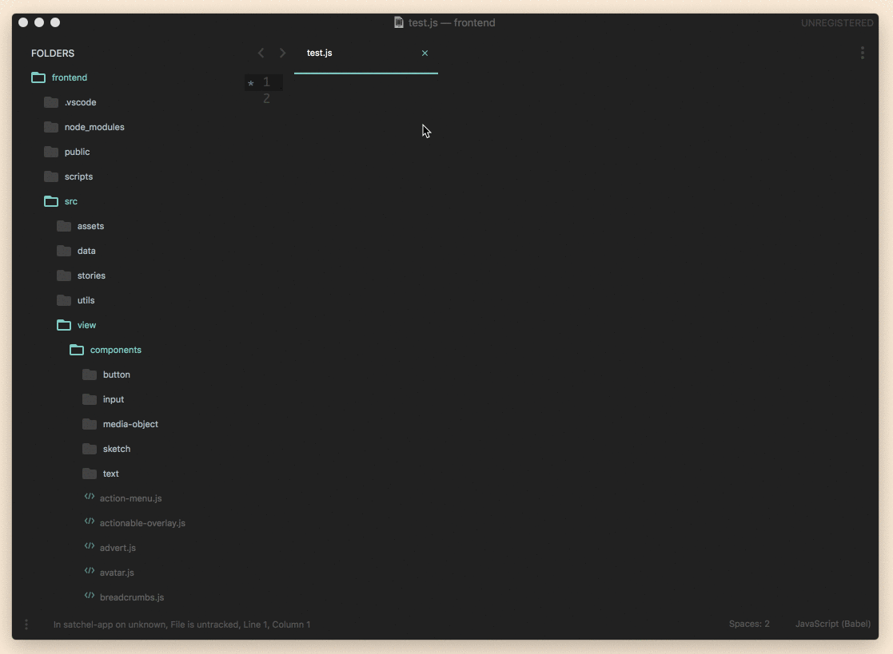

# Sublime Text 3/4 Import Cost Package

Sublime Text 3/4 package that shows the [cost of imported JS modules](https://github.com/wix/import-cost/). A working version of [julianburr/sublime-import-cost](https://github.com/julianburr/sublime-import-cost).



## Prerequisites

- NodeJS >= 14
- Sublime Text >= 3.0 (BUILD 3143)

## Install

~~The best way is to install the plugin via [Package Control](https://packagecontrol.io/), just search for `import cost`. Besides that, you also have to have [`node`](https://nodejs.org/en/) installed, as well as the npm package [`import-cost`](https://github.com/wix/import-cost):~~

Clone or copy this repo into Sublime Text 3/4 packages folder (Preferences -> Browse Packages), then open your prefered CLI and navigate to the `ImportCost` folder within 'Packages'.

Once you're inside the folder, install all of the package's dependencies using this command:
```bash
yarn install
```

## Config

To change config options, open the menu `Sublime Text > Preferences > Package Settings > Import Cost > Settings – User` after installing the plugin. The following options are available:

```js
{
  // Check import costs of npm modules only when saving a file.
  // If false then it will try to get the cost every time file get modified.
  "check_on_save_only": true,

  // Check import costs when opening a file
  "check_on_open": true,

  // File sizes for differnt warning levels in kb
  "min_size_warning": 40,
  "min_size_error": 100,

  // Path to node binary
  "node_path": "/usr/local/bin/node",

  // File extensions that should be considered
  "extensions": [ "js", "jsx", "ts", "tsx" ],

  // Show gzip size as well
  "show_gzip": false,

  // Show import cost message in console for debugging
  "debug": false
}
```

## Troubleshoots

> Error: Couldn't find "node" in "/path/to/node/executable"

Check the value of `node_path` config within the `Sublime Text > Preferences > Package Settings > Import Cost > Settings – User` menu. You must put a valid path to the node binary file which installed in your machine. It depends on how you install it. Default value is `/usr/local/bin/node`.

## Want to Contribute?

**_TBA_**

## Have a Question?

Use [Discussion page](https://github.com/arviantodwi/st-import-cost/discussions) in this repo to ask anything. Issues page should only be used for, as the name suggests, **issues** 😜.

## Shoutouts

To [wix](https://github.com/wix/import-cost/) for the awesome npm package, [@julianburr](https://github.com/julianburr) for the original version of Sublime Import Cost package and to [@princemaple](https://github.com/princemaple) for the contribution to make this plugin work on Windows as well 🎉.

## Todos

- [x] ~~Add basic menus and settings~~
- [x] ~~Add "show gzip" option~~
- [x] ~~Make plugin smarter to always find correct `node_modules` folder, no matter what folder is currently open in Sublime~~
- [x] ~~Windows support~~
- [ ] Make plugin available through https://packagecontrol.io
- [ ] Add caching on python level (Wix's import-cost has the caching itself, but we still have the expensive node bridge thing going on, which is very avoidable)
- [ ] Use github project to list all of the issues/bugs/problems/improvement
